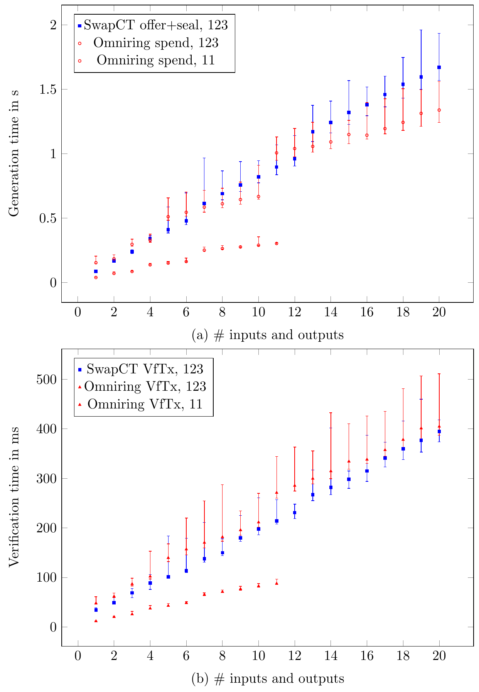

# SwapCT Proof of Concept

This repository serves as a Proof of Concept implementation of the Swap Confidential Transaction system.

# ATTENTION
This code is not secure! Do not use it in any relevant setting.

## Review

While the corresponding paper is under review, this repository will not reveal the authors for double-blind purposes.

# Usage

You need a recent (1.48) rust installation with cargo.

## Test

To run the unit tests, use

    cargo test
    
## Performance Reproducibility

### With docker

    docker build --tag swapct .
    docker run -v "$(pwd)/plots:/usr/src/swapct/plots" --rm -it swapct -r 1019 -o 20 -s 30

enjoy your plot in `plots/main.pdf` which will look like

### Manually

As the authors promote the creation of reproducible results and it is hard to give absolute performance figures, 
we encourage you to recreate the generation and verification times in your environment.

To generate the timings run

    cargo run --bin plots --release -- -r 27 -o 20 -s 30 

which presents you a progress bar and the parameters used, e.g.
    
     Finished release [optimized] target(s) in 0.05s
      Running `target/release/plots -r 27 -o 5 -s 4`
    using Opt { statistics: 4, outputs: 5, ring: 27 }
    [00:00:00] [##########>-----------------------------] 5/20 (1s)

* -r is the ring size used for the input ring signatures. This has to be of the form 2^x-5
* -o is the maximum number of outputs. It will calculate the times from 1 input and output up to the specified value-
* -s is the number of measurements performed for each setting.

The program outputs two files `plots/generation.tex` and `plots/verification.tex`. 
To plot them nicely in comparison to the authors measurements, change to the plots directory and compile the `main.tex` with `pdflatex`

    cd plots
    pdflatex main.tex
   
and enjoy the results in `main.pdf`